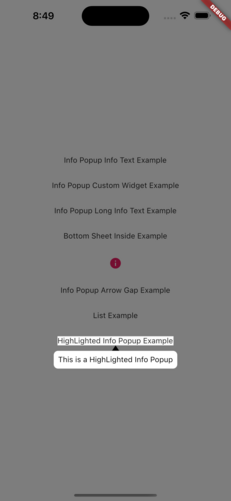

## Introduction

The `info_popup` package allows you to easily show a **simple**, **customizable** popup on your wrapped widget. The **highlight feature**, which can be activated at will, helps draw the user's attention to the desired location. 

You can test it now on the [Info Popup preview page](https://info-popup.web.app/#/ "Info Popup"). 
Note that the website experience may be different.

## Features

- Display a ***customizable*** popup on your wrapped widget
- Activate the ***highlight*** feature to draw the user's attention to the desired location
- Fully customize the content of the popup
- Add margins to the popup from ***any side***




## Getting Started

To use this package, add `info_popup` as a dependency in your `pubspec.yaml` file.

```yaml
dependencies:
  info_popup: ^2.4.6 
```

Alternatively, you can add it to your project by running the following commands in your terminal:

with Dart:

```shell
$ dart pub add info_popup
```

with Flutter:

```shell
$ flutter pub add info_popup
```

## Usage

To show a popup, wrap the widget that you want to display the popup on with the `InfoPopupWidget` widget. All you have to do is wrap it in the widget you want to show information with the `InfoPopupWidget` widget. With the `InfoPopupController`, you can customize it as you wish, and turn it on and off.

```dart
import 'package:info_popup/info_popup.dart';
```

```dart
	InfoPopupWidget(
		contentTitle: 'Info Popup Details',
		child: Icon(
			Icons.info,
			color: Colors.pink,
		),
	),
```

## Example 

This is a normal info text displayed using the `InfoPopupWidget` widget with several optional parameters.

```dart
              InfoPopupWidget(
                contentTitle: 'Info Popup Details',
                arrowTheme: InfoPopupArrowTheme(
                  color: Colors.pink,
                  arrowDirection: ArrowDirection.up,
                ),
                contentTheme: InfoPopupContentTheme(
                  infoContainerBackgroundColor: Colors.black,
                  infoTextStyle: TextStyle(color: Colors.white),
                  contentPadding: const EdgeInsets.all(8),
                  contentBorderRadius: BorderRadius.all(Radius.circular(10)),
                  infoTextAlign: TextAlign.center,
                ),
                dismissTriggerBehavior: PopupDismissTriggerBehavior.onTapArea,
                areaBackgroundColor: Colors.transparent,
                indicatorOffset: Offset.zero,
                contentOffset: Offset.zero,
                onControllerCreated: (controller) {
                  print('Info Popup Controller Created');
                },
                onAreaPressed: (InfoPopupController controller) {
                  print('Area Pressed');
                },
                infoPopupDismissed: () {
                  print('Info Popup Dismissed');
                },
                onLayoutMounted: (Size size) {
                  print('Info Popup Layout Mounted');
                },
                child: Icon(
                  Icons.info,
                  color: Colors.pink,
                ),
              ),
```
"This is a ***custom popup*** example created using the `InfoPopupWidget` widget.

##### Custom Popup Widget
```dart
              InfoPopupWidget(
                customContent: Container(
                  decoration: BoxDecoration(
                    color: Colors.blueGrey,
                    borderRadius: BorderRadius.circular(10),
                  ),
                  padding: const EdgeInsets.all(10),
                  child: Column(
                    children: const <Widget>[
                      TextField(
                        decoration: InputDecoration(
                          hintText: 'Enter your name',
                          hintStyle: TextStyle(color: Colors.white),
                          enabledBorder: OutlineInputBorder(
                            borderSide: BorderSide(color: Colors.white),
                          ),
                        ),
                      ),
                      SizedBox(height: 10),
                      Center(
                        child: Text(
                          'Example of Info Popup inside a Bottom Sheet',
                          style: TextStyle(
                            color: Colors.white,
                          ),
                        ),
                      ),
                    ],
                  ),
                ),
                arrowTheme: const InfoPopupArrowTheme(
                  color: Colors.pink,
                  arrowDirection: ArrowDirection.up,
                ),
                dismissTriggerBehavior: PopupDismissTriggerBehavior.onTapArea,
                areaBackgroundColor: Colors.transparent,
                indicatorOffset: Offset.zero,
                contentOffset: Offset.zero,
                onControllerCreated: (controller) {
                  print('Info Popup Controller Created');
                },
                onAreaPressed: (InfoPopupController controller) {
                  print('Area Pressed');
                },
                infoPopupDismissed: () {
                  print('Info Popup Dismissed');
                },
                onLayoutMounted: (Size size) {
                  print('Info Popup Layout Mounted');
                },
                child: Icon(
                  Icons.info,
                  color: Colors.pink,
                ),
              ),
```


## Conclusion

The info_popup package provides a simple and effective way to show a customizable popup on your wrapped widget. With the highlight feature, you can draw the user's attention to the desired location.

## License

This project is licensed under the MIT License - see the [LICENSE](https://github.com/SalihCanBinboga/info_popup/blob/master/LICENSE "LICENSE") file for details.
