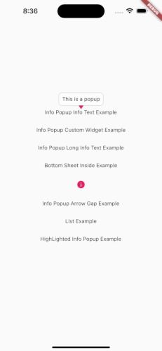

# Info Popup ([pub.dev](http://pub.dev/packages/info_popup "pub.dev"))

The simple way to show the user some information on your selected widget.

## Features

- Info holder with dynamic size
- Fully editable content area



## Getting started

### Use this package as a Library
---
Depend On it

Run this command

with Dart:

```
$ dart pub add info_popup
```

with Flutter:

```
$ flutter pub add info_popup
```

This will add a line like this to your package's pubspec.yaml (and run an implicit `dart pub get` or `flutter pub get`):

```
dependencies:
  info_popup: ^1.0.0
```

## Usage

All you have to do is wrap it in the widget you want to show information with **InfoPopupWidget**. With **InfoPopupController**, you can customize it as you wish, and turn it off and on.

##### Normal Info Text Using
```dart
            InfoPopupWidget(
onControllerCreated: (InfoPopupController controller) {
controller.show();
},
arrowTheme: const InfoPopupArrowTheme(
arrowDirection: ArrowDirection.down, color: Colors.pink),
infoText: 'This is a popup',
child: const Text('Info Popup Info Text Example'),
),
```

##### Custom Popup Widget
```dart
InfoPopupWidget(
onControllerCreated: (InfoPopupController controller) {
controller.show();
},
arrowTheme: const InfoPopupArrowTheme(
color: Colors.black87,
),
infoWidget: Container(
width: context.screenWidth * .8,
height: 100,
decoration: BoxDecoration(
color: Colors.red,
borderRadius: BorderRadius.circular(10),
),
child: const Center(
child: Text(
'This is a custom widget',
style: TextStyle(
color: Colors.white,
),
),
),
),
child: const Text('Info Popup Custom Widget Example'),
),
```